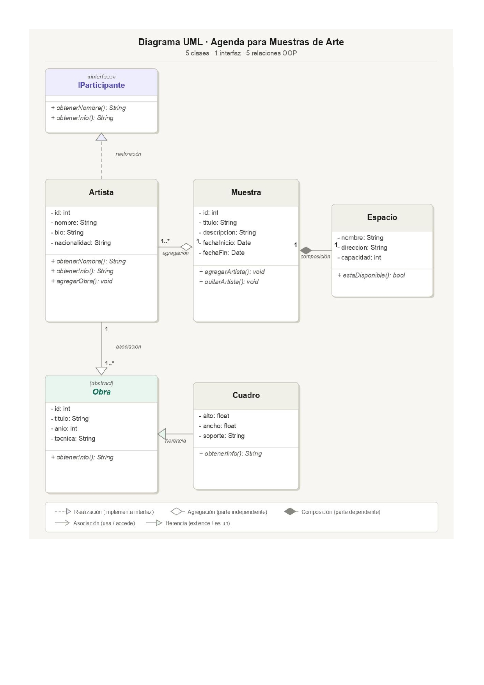

# 🎨 Gestor de Exposiciones

> Aplicación de escritorio desarrollada en **C# .NET · WinForms · SQL Server**  
> Proyecto integrador universitario — Facultad de Tecnología Informática, UAI  
> Materia: Lenguaje de Última Generación · Prof. Ing. Mauricio Prinzo

---

## 📋 ¿Qué es este proyecto?

El **Gestor de Exposiciones** es una aplicación de escritorio pensada para **curadores de arte independientes** que organizan muestras y exposiciones.

El problema que resuelve: un curador maneja múltiples artistas, obras, espacios y fechas al mismo tiempo, generalmente con herramientas informales como hojas de cálculo o papel. Este sistema centraliza toda esa información en un entorno ordenado, con alta y baja de registros, validaciones y reportes.

### ¿Qué puede hacer el sistema?

- Registrar y gestionar **artistas** participantes de una muestra
- Cargar **obras** con sus datos técnicos (título, año, técnica)
- Registrar **cuadros** como tipo específico de obra, con dimensiones y soporte
- Crear y administrar **muestras** con fechas de inicio y fin
- Asignar **espacios físicos** a cada muestra (nombre, dirección, capacidad)
- Consultar disponibilidad de un espacio para una fecha determinada
- Realizar altas, bajas y modificaciones (ABM) sobre todas las entidades
- Generar informes sobre las exposiciones registradas

---

## 🗂️ Diagrama UML · Modelo de Dominio

El modelo de dominio expone los 5 principios de la Programación Orientada a Objetos y los 5 tipos de relación entre clases.

> El diagrama fue aprobado por el docente como parte del TP N1.



### Entidades del sistema

| Entidad | Tipo | Descripción |
|---|---|---|
| `IParticipante` | Interface | Contrato que define `ObtenerNombre()` y `ObtenerInfo()` |
| `Artista` | Clase concreta | Implementa `IParticipante`. Tiene id, nombre, bio, nacionalidad |
| `Obra` | Clase abstracta | Clase base para tipos de obra. Define `ObtenerInfo()` abstracto |
| `Cuadro` | Clase concreta | Hereda de `Obra`. Agrega alto, ancho y soporte |
| `Muestra` | Clase concreta | Agrupa artistas y tiene un espacio asignado |
| `Espacio` | Clase concreta | Nombre, dirección y capacidad. Parte de una muestra |

### Relaciones OOP representadas

| Relación | Entre | Descripción |
|---|---|---|
| **Realización** | `Artista` → `IParticipante` | Artista implementa el contrato de la interfaz |
| **Herencia** | `Cuadro` → `Obra` | Cuadro extiende Obra (es-un) |
| **Asociación** | `Artista` → `Obra` | Un artista tiene una o más obras |
| **Agregación** | `Muestra` → `Artista` | Muestra agrupa artistas (1 a muchos) |
| **Composición** | `Muestra` → `Espacio` | El espacio existe en el contexto de la muestra |

---

## 🏗️ Arquitectura · 4 Capas (Tier Architecture)

El sistema está dividido en **4 proyectos independientes** dentro de una misma solución de Visual Studio. Cada proyecto compila como un ensamblado `.dll` separado, lo que garantiza que las dependencias entre capas sean explícitas y controladas por el compilador.

```
GestorExposiciones.sln
├── GestorExposiciones.BE          ← Business Entities
├── GestorExposiciones.BLL         ← Business Logic Layer
├── GestorExposiciones.DAL         ← Data Access Layer
└── GestorExposiciones.UI          ← User Interface
```

### ¿Qué hace cada capa?

#### 📦 BE · Business Entities
Las clases puras del dominio. No contienen lógica de negocio ni acceso a datos — solo representan los objetos del mundo real con sus atributos y métodos básicos.

**Contiene:** `IParticipante`, `Artista`, `Obra` (abstract), `Cuadro`, `Muestra`, `Espacio`  
**Referencia a:** nadie  
**La referencian:** BLL y DAL

```
Por qué existe separada: tanto BLL como DAL necesitan conocer las entidades.
Si estuvieran en la misma capa, se generarían referencias circulares.
BE como ensamblado propio rompe ese problema.
```

#### ⚙️ BLL · Business Logic Layer
La lógica de negocio: validaciones, reglas, polimorfismo. Es la capa que decide *cómo* se procesan los datos antes de guardarlos o mostrarlos.

**Contiene:** servicios de negocio, validaciones, uso de polimorfismo  
**Referencia a:** BE  
**La referencian:** UI

```
Ejemplo: antes de registrar una muestra, BLL valida que la fecha de fin
sea posterior a la fecha de inicio, y que el espacio esté disponible.
```

#### 🗄️ DAL · Data Access Layer
Todo el acceso a SQL Server. Contiene el SQL embebido, las transacciones y la tabla intermedia de la relación N:M entre Muestra y Artista.

**Contiene:** conexión a BD, comandos SQL, transacciones, manejo de errores de BD  
**Referencia a:** BE  
**La referencian:** UI

```
El SQL está embebido en C# (no usa ORM). Cada operación usa
try/catch para atrapar errores de SQL Server (ítem 14 del TP).
```

#### 🖥️ UI · User Interface
Los formularios WinForms. Captura los inputs del usuario y llama a BLL para procesarlos. No contiene lógica de negocio ni SQL.

**Contiene:** MDI principal, formularios ABM, DataGridView, combos, Login, reportes  
**Referencia a:** BLL y DAL

```
La UI no sabe cómo se guardan los datos ni cómo se validan.
Solo sabe mostrar y capturar. Las capas de abajo hacen el resto.
```

### Diagrama de dependencias entre capas

```
        UI
       /  \
     BLL   DAL
       \  /
        BE
        |
     SQL Server
```

> Regla de oro: una capa solo puede referenciar a la(s) que están debajo de ella en el diagrama. Nunca al revés.

---

## 🛠️ Tecnologías utilizadas

| Tecnología | Uso en el proyecto |
|---|---|
| C# .NET | Lenguaje principal |
| WinForms | Interfaz de escritorio (UI) |
| SQL Server | Base de datos relacional |
| SQL embebido | Acceso a datos desde DAL |
| Visual Studio | IDE de desarrollo |
| Git + GitHub | Control de versiones |
| Jira | Gestión de tareas y backlog |

---

## ✅ Requisitos académicos cubiertos (TP N1)

| Ítem | Requisito | Cómo se implementa |
|---|---|---|
| 1 | Relaciones 1 a 1 y 1 a muchos | `Muestra → Espacio` (1:1) · `Muestra → Artistas` (1:N) |
| 2 | Diagrama de clases | Ver sección UML de este README |
| 3 | ABM de todas las clases | Formularios de alta, baja y modificación por entidad |
| 4 | Namespaces distintos en 2+ clases | Cada ensamblado tiene su propio namespace |
| 5 | Regiones en 2+ clases | `#region` en clases de BE y BLL |
| 6 | MDI + ABMs + DataGridView + Combos | Formulario MDI principal con hijos por entidad |
| 7 | Herencia y polimorfismo en BLL | `Cuadro` hereda `Obra` · `ObtenerInfo()` sobreescrito |
| 8 | Constructor sobrecargado | Al menos una clase con múltiples constructores |
| 9 | SQL Server con tabla intermedia | BD con tabla pivot `MuestraArtista` (N:M) |
| 10 | Login con validación en BD + Logout | Formulario de login · usuario habilitado desde BD |
| 11 | Exit que cierra todas las ventanas | Método en MDI que cierra hijos antes de salir |
| 12 | Encriptación en algún campo | Contraseña del usuario encriptada |
| 13 | ABM conectado con transacciones | DAL usa `BEGIN TRAN / COMMIT / ROLLBACK` |
| 14 | Manejo de errores en todo el código | `try/catch` en toda la app, incluyendo SQL |
| 15 | Informes | Al menos un reporte de muestras registradas |
| 16 | Todos los puntos obligatorios | ✓ |

---

## 📁 Estructura del repositorio

```
GestorExposiciones/
├── docs/
│   ├── diagrama_uml.png
│   └── caso_de_uso.png
├── GestorExposiciones.BE/
├── GestorExposiciones.BLL/
├── GestorExposiciones.DAL/
├── GestorExposiciones.UI/
├── GestorExposiciones.sln
└── README.md
```

---

## 🚀 Estado del proyecto

| Etapa | Estado |
|---|---|
| Diagrama UML | ✅ Aprobado |
| Estructura de la solución | 🔄 En progreso |
| Modelo de base de datos | ✅ Aprobado |
| Capa BE | 🔄 En progreso |
| Capa DAL | 🔄 En progreso |
| Capa BLL | 🔄 En progreso |
| Capa UI (formularios) | 🔄 En progreso |
| Login + Seguridad | 🔄 En progreso |
| Informes | ⏳ Pendiente |

---

## 👩‍💻 Autora

**Beatriz Ebert**  
Analista Programadora · Full-Stack .NET Developer  
📍 Buenos Aires, Argentina  
[](https://linkedin.com/in/beatrizebert)
[](https://github.com/Beaebert)


